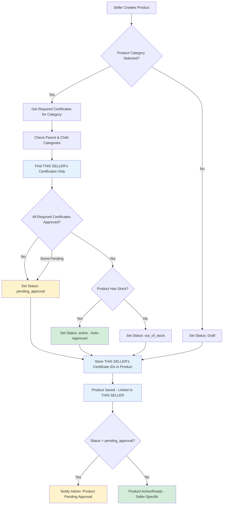
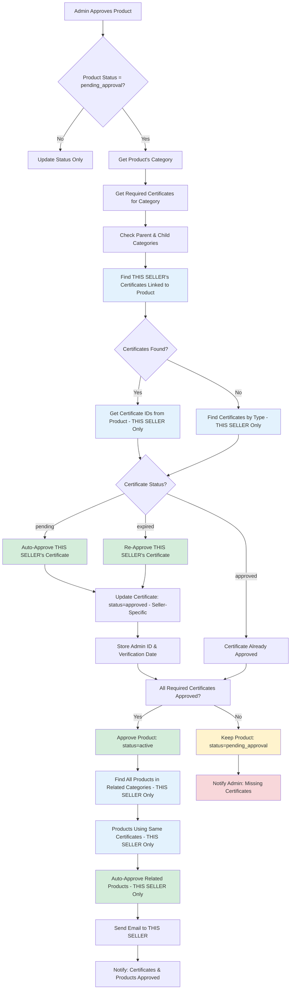
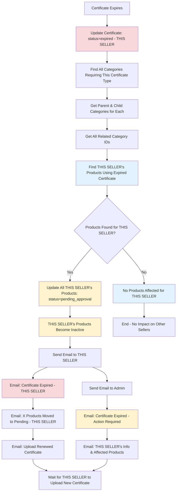
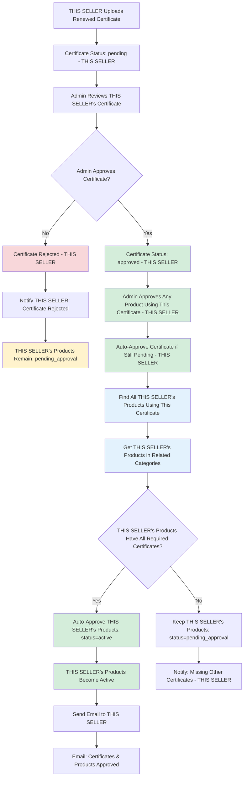
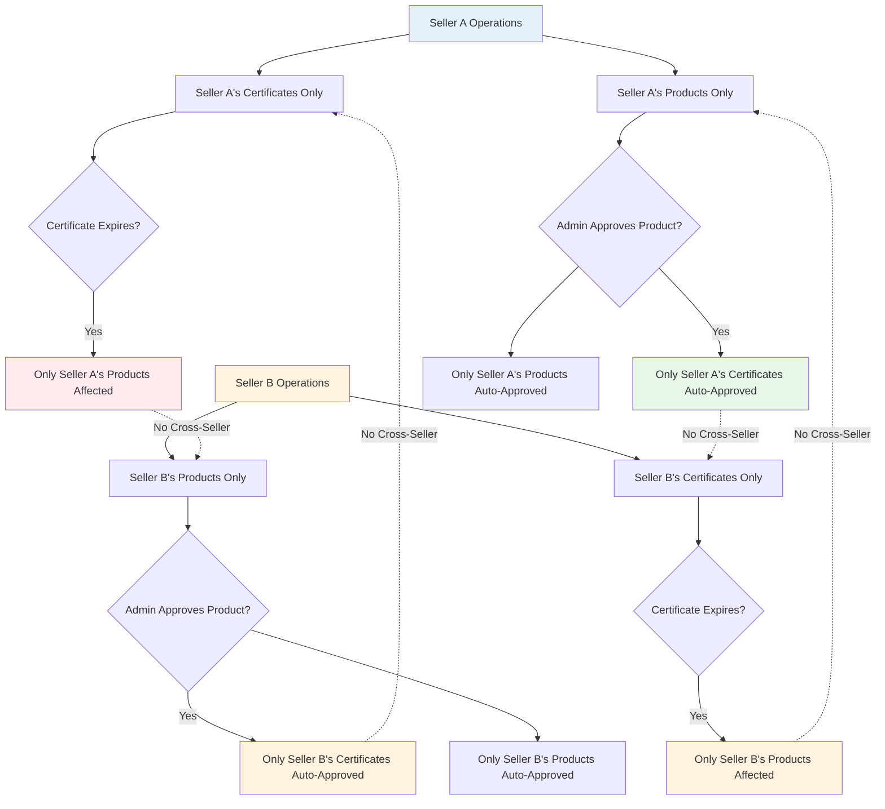

# Certificate-Based Product Approval System - Flow Diagram

## Overview
This document describes the complete flow of the certificate-based product approval system, including product creation, admin approval, certificate expiration, and re-approval flows.

**🔒 CRITICAL: All operations are SELLER-SPECIFIC. Each seller's certificates and products operate independently with complete data isolation. No cross-seller data access is possible.**

## Quick Summary

### Core Principles
1. **Seller Isolation**: Every certificate and product is tied to a specific seller
2. **Auto-Approval**: Products with approved certificates are automatically active
3. **Certificate Inheritance**: Categories inherit certificate requirements from parents
4. **Category Relationships**: System checks parent and child categories for related products
5. **Expiration Handling**: Expired certificates affect only that seller's products
6. **Re-Approval Flow**: Admin approval of one product can reactivate all related products for that seller

### Key Flows
- **Product Creation**: Checks seller's certificates → Auto-approves if all certificates approved
- **Admin Approval**: Approves product → Auto-approves seller's certificates → Auto-approves seller's related products
- **Certificate Expiration**: Expires certificate → Deactivates seller's products → Requires re-approval
- **Re-Approval**: Admin approves product → Re-approves certificate → Reactivates seller's products

## Main Flow Diagrams

### 1. Product Creation Flow (Seller-Specific)

### 2. Admin Product Approval Flow (Seller-Specific)

### 3. Certificate Expiration Flow (Seller-Specific)

### 4. Re-Approval Flow (After Certificate Expiration - Seller-Specific)

### 5. Complete System Flow (End-to-End - Seller-Specific)

```mermaid
flowchart TD
    Start([THIS SELLER Starts]) --> Create[Create Product with Category]
    Create --> CheckCert{Category Requires Certificates?}
    
    CheckCert -->|No| AutoActive[Product: Active - THIS SELLER]
    CheckCert -->|Yes| FindCert[Find THIS SELLER's Certificates Only]
    
    FindCert --> CertStatus{Certificate Status?}
    CertStatus -->|All Approved| AutoActive
    CertStatus -->|Some Pending| Pending[Product: Pending Approval - THIS SELLER]
    CertStatus -->|Missing| Pending
    
    Pending --> AdminReview[Admin Reviews THIS SELLER's Product]
    AdminReview --> AdminDecision{Admin Decision?}
    
    AdminDecision -->|Approve| ApproveCert[Auto-Approve THIS SELLER's Certificates]
    AdminDecision -->|Reject| Rejected[Product: Rejected - THIS SELLER]
    
    ApproveCert --> ApproveProd[Approve THIS SELLER's Product]
    ApproveProd --> FindRelated[Find THIS SELLER's Related Products Only]
    FindRelated --> AutoApproveRelated[Auto-Approve THIS SELLER's Related Products]
    
    AutoActive --> Monitor[Monitor THIS SELLER's Certificates]
    AutoApproveRelated --> Monitor
    Rejected --> End1([End])
    
    Monitor --> CertExpiry{THIS SELLER's Certificate Expires?}
    CertExpiry -->|No| Monitor
    CertExpiry -->|Yes| ExpireCert[Certificate: Expired - THIS SELLER]
    
    ExpireCert --> FindAffected[Find THIS SELLER's Affected Products Only]
    FindAffected --> Deactivate[THIS SELLER's Products: Pending Approval]
    Deactivate --> NotifyExpiry[Notify THIS SELLER & Admin]
    
    NotifyExpiry --> UploadNew[THIS SELLER Uploads New Certificate]
    UploadNew --> NewCertPending[Certificate: Pending - THIS SELLER]
    NewCertPending --> AdminReviewNew[Admin Reviews THIS SELLER's New Certificate]
    
    AdminReviewNew --> AdminDecisionNew{Admin Decision?}
    AdminDecisionNew -->|Approve| ReApprove[Re-Approve THIS SELLER's Certificate]
    AdminDecisionNew -->|Reject| NewCertPending
    
    ReApprove --> ReApproveProd[Admin Approves Any Product - THIS SELLER]
    ReApproveProd --> Reactivate[Reactivate THIS SELLER's All Products]
    Reactivate --> Monitor
    
    style AutoActive fill:#d4edda
    style ApproveCert fill:#d4edda
    style ApproveProd fill:#d4edda
    style AutoApproveRelated fill:#d4edda
    style Reactivate fill:#d4edda
    style Pending fill:#fff3cd
    style ExpireCert fill:#f8d7da
    style Deactivate fill:#fff3cd
    style Rejected fill:#f8d7da
    style FindCert fill:#e3f2fd
    style FindRelated fill:#e3f2fd
    style FindAffected fill:#e3f2fd
    style Monitor fill:#e3f2fd
```

### 6. Seller-Specific Isolation Flow

## Key Components

### Certificate States
- **pending**: Certificate uploaded, awaiting admin approval
- **approved**: Certificate verified and active
- **rejected**: Certificate rejected by admin
- **expired**: Certificate has passed its expiry date

### Product States
- **draft**: Product not yet published
- **pending_approval**: Product awaiting admin/certificate approval
- **active**: Product live and available
- **inactive**: Product manually deactivated
- **out_of_stock**: Product has no stock

### Category Hierarchy
- **Parent Categories**: Child categories inherit certificate requirements
- **Child Categories**: Can override parent requirements or inherit them
- **Related Categories**: When checking products, system checks parent and all child categories
- **Seller-Specific**: Category checks are performed within the context of a specific seller's products and certificates

## Email Notifications (Seller-Specific)

### To Seller
1. **Product Pending Approval**: When THIS SELLER's product requires certificate approval
2. **Certificate Approved**: When THIS SELLER's certificate is approved with product
3. **Certificate Expired**: When THIS SELLER's certificate expires and THIS SELLER's products are affected
4. **Products Auto-Approved**: When THIS SELLER's products are auto-approved after certificate approval

### To Admin
1. **Product Pending Approval**: New product from a specific seller requires review
2. **Certificate Expired**: Certificate expired for a specific seller, that seller's products need attention
3. **Certificate Pending**: New certificate uploaded by a specific seller

## Important Rules

1. **Seller-Specific Operations**: ALL operations are seller-specific:
   - Certificates belong to a specific seller
   - Products belong to a specific seller
   - Certificate checks only look at that seller's certificates
   - Product approvals only affect that seller's products
   - Certificate expiration only affects that seller's products
   - Auto-approval only affects products from the same seller

2. **Auto-Approval**: Products with all required certificates approved are automatically active (seller-specific)

3. **Certificate Inheritance**: Child categories inherit parent certificate requirements (unless overridden)

4. **Category Relationships**: System checks parent and child categories when finding affected products (within the same seller)

5. **Certificate Tracking**: Each product stores certificate IDs it uses (seller-specific certificates only)

6. **Re-Approval Flow**: When certificate expires, all products of that seller become pending until admin re-approves

## Seller-Specific Guarantees

### Certificate Operations
- ✅ Certificate upload: Always linked to the authenticated seller
- ✅ Certificate approval: Only affects that seller's certificates
- ✅ Certificate expiration: Only affects that seller's products
- ✅ Certificate queries: Always filtered by `seller: sellerId`

### Product Operations
- ✅ Product creation: Always linked to the authenticated seller
- ✅ Product approval: Only affects that seller's products
- ✅ Auto-approval: Only approves products from the same seller
- ✅ Product queries: Always filtered by `seller: sellerId`

### Cross-Operations
- ✅ When admin approves a product, only that seller's certificates are auto-approved
- ✅ When certificates are approved, only that seller's products are auto-approved
- ✅ When a certificate expires, only that seller's products are affected
- ✅ All database queries include seller filtering to prevent cross-seller data access

---

## Admin Guide: Understanding the Certificate-Product Approval Flow

### Quick Reference for Admins

As an admin, understanding this flow helps you make informed decisions when reviewing products and certificates. Here's what you need to know:

### 🔍 When Reviewing a Product

**What to Check:**
1. **Product Category**: Check what certificates are required for this category (including parent categories)
2. **Seller's Certificates**: Verify the seller has uploaded all required certificates
3. **Certificate Status**: Check if certificates are approved, pending, or expired

**What Happens When You Approve a Product:**
- ✅ **Auto-Approval Magic**: If the product uses pending certificates, they are automatically approved
- ✅ **Cascade Effect**: All other products from the same seller using those certificates are also auto-approved
- ✅ **Category Scope**: Products in related categories (parent/child) are also checked and auto-approved if they meet requirements
- ✅ **Seller Notification**: The seller receives an email notification about certificate and product approval

**Important Notes:**
- Approving one product can activate multiple products for that seller
- Only affects products from the same seller (seller-specific)
- Products in related categories (parent/child) are also considered

### 📋 When Reviewing a Certificate

**What to Check:**
1. **Certificate Validity**: Verify the document is legitimate and matches the certificate type
2. **Expiry Date**: Check if the certificate has an expiry date and when it expires
3. **Certificate Number**: Verify if provided and matches the document

**What Happens When You Approve a Certificate:**
- ✅ **Standalone Approval**: Certificate is marked as approved
- ✅ **Product Impact**: Products using this certificate may become eligible for auto-approval
- ⚠️ **No Auto-Product Approval**: Approving a certificate alone does NOT automatically approve products
- ℹ️ **Product Approval Required**: You still need to approve at least one product to trigger the cascade effect

**Best Practice:**
- If a seller has uploaded certificates and products are pending, approve a product (not just the certificate)
- This triggers the full auto-approval flow for all related products

### ⚠️ Certificate Expiration Handling

**What Happens Automatically:**
- When a certificate expires, the system automatically:
  1. Marks the certificate as `expired`
  2. Finds all products using that certificate (seller-specific)
  3. Moves those products to `pending_approval` status
  4. Sends notifications to both seller and admin

**Your Role:**
- Monitor expired certificates in the admin panel
- When seller uploads a renewed certificate, review and approve it
- Approve at least one product using the renewed certificate to reactivate all related products

### 🔄 Re-Approval Flow (After Certificate Expiration)

**Scenario**: A seller's certificate expired, and their products are now pending approval.

**Steps:**
1. **Seller Uploads Renewed Certificate** → Status: `pending`
2. **You Review Certificate** → Approve or reject
3. **You Approve Any Product Using This Certificate** → This triggers:
   - Certificate is re-approved (if still pending)
   - All products using this certificate are auto-approved
   - Products in related categories are also checked and auto-approved
   - Seller is notified

**Key Insight**: You only need to approve ONE product to reactivate ALL related products for that seller.

### 📊 Admin Dashboard Indicators

**What to Look For:**
- **Pending Products**: Products waiting for certificate approval
- **Expired Certificates**: Certificates that have expired (affects seller's products)
- **Pending Certificates**: New certificates uploaded by sellers
- **Product-Certificate Mismatch**: Products in categories requiring certificates but seller hasn't uploaded them

### ✅ Best Practices for Admins

1. **Approve Products, Not Just Certificates**
   - Approving a product triggers the full auto-approval cascade
   - This is more efficient than approving certificates individually

2. **Check Category Requirements**
   - Before approving, verify what certificates are required for the product's category
   - Check parent categories as they may have certificate requirements

3. **Monitor Certificate Expirations**
   - Set up alerts for certificates expiring soon
   - Proactively notify sellers before certificates expire

4. **Batch Approval Strategy**
   - If a seller has multiple products pending, approve one product
   - This will auto-approve all related products if certificates are valid

5. **Seller Communication**
   - If rejecting, provide clear reasons
   - If certificates are missing, use the "Remind Missing Certificates" feature

### 🎯 Common Scenarios

#### Scenario 1: New Seller, First Product
- Seller uploads product → Product requires certificates → Product goes to `pending_approval`
- Seller uploads certificates → Certificates go to `pending`
- **You approve the product** → Certificates auto-approved → Product approved → Future products auto-approved

#### Scenario 2: Existing Seller, New Product Category
- Seller has approved certificates for Category A
- Seller adds product in Category B (requires different certificates)
- Product goes to `pending_approval` (missing Category B certificates)
- Seller uploads new certificates → **You approve product** → New certificates approved → Product approved

#### Scenario 3: Certificate Expiration
- Seller's certificate expires → All products using it go to `pending_approval`
- Seller uploads renewed certificate → **You approve it**
- **You approve any product using this certificate** → All products reactivated

#### Scenario 4: Multiple Products, Same Certificates
- Seller has 10 products pending, all using the same certificates
- **You approve ONE product** → All 10 products are auto-approved (if certificates are valid)

### 🔐 Security & Isolation

**Remember:**
- All operations are seller-specific
- Approving Seller A's product will NEVER affect Seller B's products
- Certificate approvals only affect that seller's products
- Complete data isolation between sellers

### 📧 Notification Summary

**You Receive Notifications For:**
- New products pending approval
- Certificates expiring (with affected product count)
- New certificates uploaded by sellers

**Sellers Receive Notifications For:**
- Certificate approved (when product is approved)
- Certificate expired (with affected product count)
- Products auto-approved (after certificate approval)

